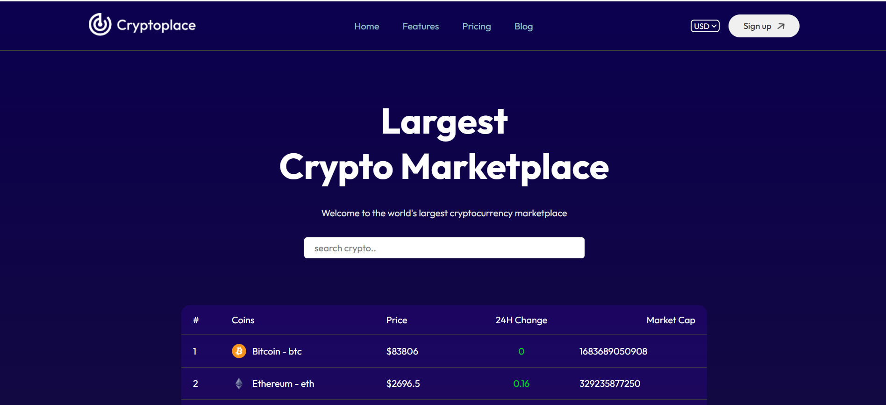
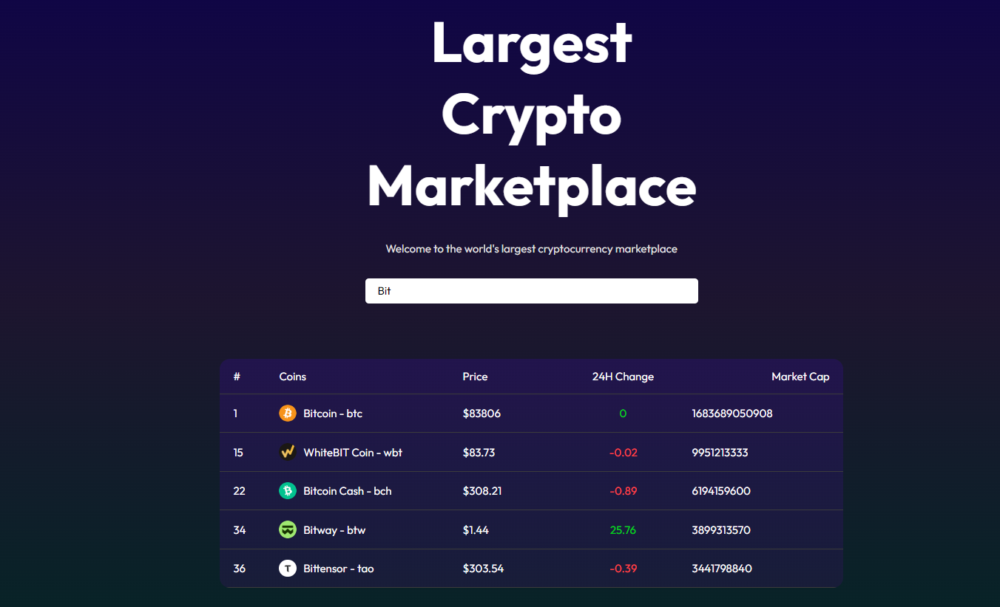
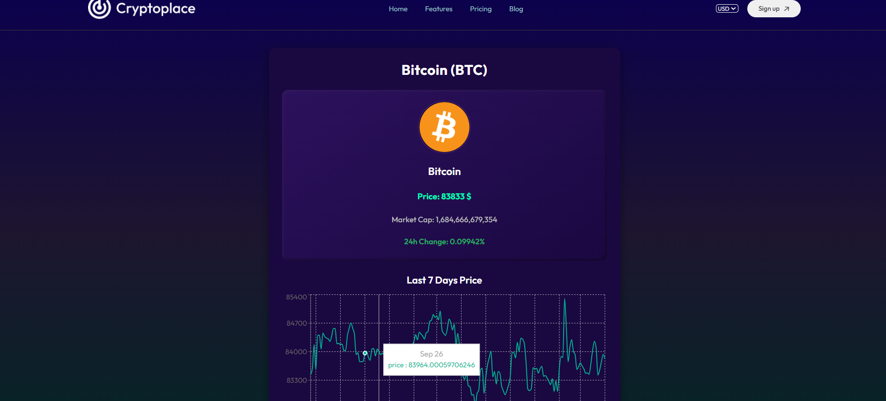
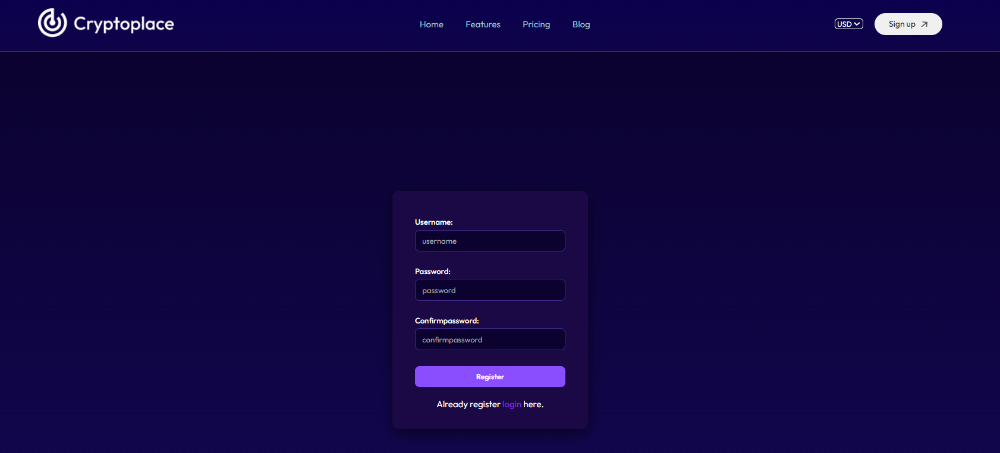

<div align="center">

# 🪙 CoinTrack — Crypto Price Tracker

**A fast, responsive single-page application for tracking real-time cryptocurrency prices and market data.**


[Live Demo](#) · [Report Bug](../../issues) · [Request Feature](../../issues)


[Live Demo](#) · 
https://crypto-currency-mu.vercel.app/

</div>

---


## 📖 Overview

**CoinTrack** is a React-based web application that lets users browse the cryptocurrency market, search for coins, and open a detailed view for any asset. It is built with **React + Vite** for fast development and optimized production builds, uses **React Context API** for global state management, and **React Router** for client-side navigation.

The project demonstrates core front-end engineering concepts: component-based architecture, centralized state management, REST API integration, client-side routing, and responsive UI design.

---

## ✨ Features

- 📊 **Live market data** — view current prices, market cap, and 24h change for top cryptocurrencies
- 🔍 **Search** — quickly filter coins by name or symbol
- 💱 **Multi-currency support** — switch the display currency globally via context
- 🪙 **Coin detail page** — dynamic route (`/coin/:id`) with in-depth information per asset
- 🔐 **Authentication UI** — Login and Register pages
- 🌙 **Modern dark theme** — gradient-based UI with the Outfit typeface
- 📱 **Responsive layout** — works across desktop, tablet, and mobile
- ⚡ **Fast builds & HMR** — powered by Vite

---

## 🛠 Tech Stack

| Category         | Technology                         |
| ---------------- | ---------------------------------- |
| Framework        | React 18                           |
| Build Tool       | Vite                               |
| Routing          | React Router DOM                   |
| State Management | React Context API                  |
| Styling          | CSS3 (modular, per-component CSS)  |
| Data Source      | CoinGecko REST API                 |
| Linting          | ESLint                             |
| Typography       | Google Fonts — Outfit              |

---

## 🖼 Screenshots

| Home | Search |
| ---- | ------ |
|  |  |

| Coin Details | Login |
| ------------ | ----- |
|  |  |

---

## 🏗 Architecture

```
main.jsx
 └── BrowserRouter
      └── CoinContextProvider   ← global state (coins, selected currency)
           └── App
                ├── Navbar
                ├── Routes
                │    ├── /            → Home
                │    ├── /coin/:id    → Coin
                │    ├── /login       → Login
                │    └── /register    → Register
                └── Footer
```

- **`CoinContext`** fetches and stores market data and the selected currency, making it available to any component without prop drilling.
- **Pages** (`Home`, `Coin`, `Login`, `Register`) are route-level components.
- **Components** (`Navbar`, `Footer`) are reusable UI building blocks shared across pages.

---

## 📂 Project Structure

```
Coin/
├── public/                 # Static assets
├── src/
│   ├── assets/             # Images, icons, and static resources
│   ├── components/
│   │   ├── Navbar/         # Top navigation bar
│   │   └── Footer/         # Site footer
│   ├── context/
│   │   └── CoinContext.jsx # Global state provider
│   ├── pages/
│   │   ├── Home/           # Market overview & search
│   │   ├── Coin/           # Single coin detail page
│   │   ├── Login/          # Login page
│   │   └── Register/       # Registration page
│   ├── App.jsx             # Root component & route definitions
│   ├── App.css
│   ├── index.css           # Global styles
│   └── main.jsx            # Application entry point
├── .gitignore
├── eslint.config.js
├── index.html
├── package.json
├── vite.config.js
└── README.md
```

---

## 🚀 Getting Started

### Prerequisites

- [Node.js](https://nodejs.org/) **v18 or higher**
- **npm** (bundled with Node.js) or **yarn**
- [Git](https://git-scm.com/)

### Installation

1. **Clone the repository**

```bash
   git clone https://github.com/amankrsahu700/<your-repo-name>.git
   cd <your-repo-name>
```

2. **Install dependencies**

```bash
   npm install
```

3. **Configure environment variables** (see [below](#-environment-variables))

4. **Start the development server**

```bash
   npm run dev
```

5. Open **http://localhost:5173** in your browser.

---

## 🔑 Environment Variables

Create a `.env` file in the project root:

```env
VITE_API_BASE_URL=https://api.coingecko.com/api/v3
VITE_API_KEY=your_api_key_here
```

> ⚠️ Never commit your `.env` file. It is already excluded via `.gitignore`.

---

## 📜 Available Scripts

| Command           | Description                                  |
| ----------------- | -------------------------------------------- |
| `npm run dev`     | Starts the development server with HMR       |
| `npm run build`   | Creates an optimized production build in `dist/` |
| `npm run preview` | Serves the production build locally          |
| `npm run lint`    | Runs ESLint across the codebase              |

---

## 🧭 Routes

| Path          | Component  | Description                      |
| ------------- | ---------- | -------------------------------- |
| `/`           | `Home`     | Market overview and coin search  |
| `/coin/:id`   | `Coin`     | Detailed view for a single coin  |
| `/login`      | `Login`    | User login                       |
| `/register`   | `Register` | New user registration            |

---

## 🗺 Roadmap

- [ ] Price history charts (1D / 7D / 30D / 1Y)
- [ ] Watchlist / favorite coins
- [ ] Backend authentication (JWT)
- [ ] Light / dark theme toggle
- [ ] Skeleton loaders and improved error states
- [ ] Unit tests with Vitest + React Testing Library
- [ ] CI/CD with GitHub Actions

---

## 🤝 Contributing

Contributions are welcome!

1. Fork the repository
2. Create a feature branch: `git checkout -b feature/your-feature`
3. Commit your changes: `git commit -m "feat: add your feature"`
4. Push to the branch: `git push origin feature/your-feature`
5. Open a Pull Request

Please follow [Conventional Commits](https://www.conventionalcommits.org/) for commit messages.

---


---

## 👨‍💻 Author

**Arsh Ali**
B.Tech CSE, Jharkhand University of Technology

[](https://github.com/arshali-dev)
[](https://www.linkedin.com/in/arsh-ali-b18039256/)
[](mailto:arshali737100@gmail.com)
---

<div align="center">

⭐ If you found this project useful, consider giving it a star!

</div>
